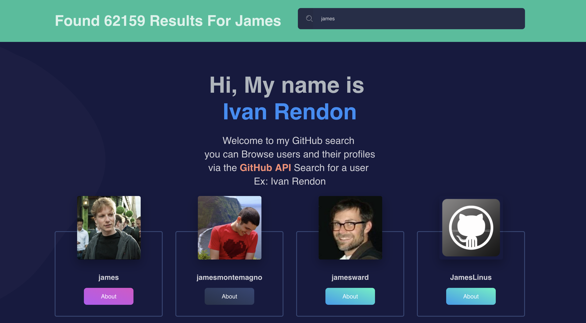
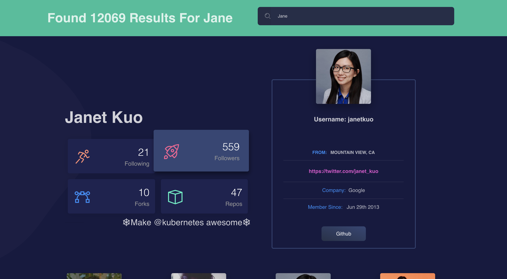

# React Github User Search [](https://tranquil-spire-91940.herokuapp.com)

Search and view users via the Github API - [Here](https://tranquil-spire-91940.herokuapp.com)

Requests are cached in session storage to limit the use of the API.

## What is this?

A personal project built with primarily React it's purpose is to give the user the ability to search GitHub users and
view their profiles as well as some information about their profiles like number of repos, number of followers and number 
as well as demographics and ways to connect with them via their blog, LinkedIn or portfolio website.

Feel free to leave comments and leave issues

### Libraries and tools

* BLK•
* Babel
* React
* React Router
* React Router Dom
* Sass
* Webpack
* Moment
* Tilt
* ReactStrap 

## Running locally

1. Clone the repository
1. Install dependencies `yarn install`
1. Run the server `yarn start`
1. Visit `http://localhost:3001` (note the trailing slash)

###  GitHub REST API

When you fetch a list of resources, the response includes a subset of the attributes for 
that resource. This is the "summary" representation of the resource. (Some attributes are 
computationally expensive for the API to provide. For performance reasons, the summary 
representation excludes those attributes. To obtain those attributes, fetch the "detailed" representation.)

:
### Basic Axios Request
```javascript
export function getAllPeople(page, name) {
    axios.get(`https://api.github.com/search/users?per_page=20&page=${page}&q=${name}`)
    .then(response => {
      return response.data;
    })
    .catch(error => {
      return error;
    });
}
```

#### Preview of the App





## TODO

* Create Routes
* Show Repos of users
* Display commit history/count